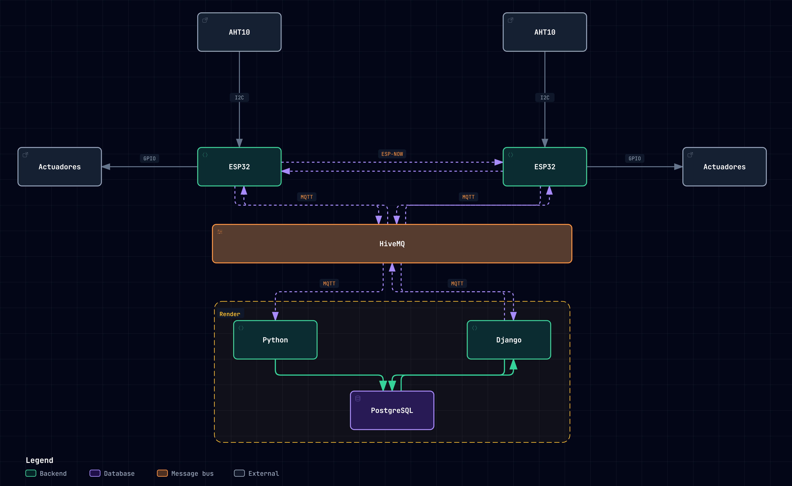

# IoT Engineering Challenge

Sistema IoT bidireccional con dos nodos ESP32 independientes, sensado de temperatura/humedad, control de actuadores (ventilador, buzzer, alarma visual), enlace directo nodo↔nodo para paro de emergencia, y una plataforma web de monitoreo y control en tiempo real sobre MQTT/PostgreSQL.



## Tabla de contenido

- [Alcance](#alcance)
- [Arquitectura](#arquitectura)
- [Tecnologías](#tecnologías)
- [Hardware y conexionado](#hardware-y-conexionado)
- [Protocolo MQTT](#protocolo-mqtt)
- [Estructura del repositorio](#estructura-del-repositorio)
- [Puesta en marcha](#puesta-en-marcha)
- [Documentación adicional](#documentación-adicional)
- [Licencia](#licencia)

## Alcance

El reto consistía en implementar, de punta a punta, dos nodos de sensado/actuación conectados a una plataforma de supervisión:

- **Adquisición**: lectura periódica de temperatura y humedad (AHT10 vía I2C) en ambos nodos.
- **Actuación local**: ventilador, buzzer y LED de alarma reaccionan automáticamente cuando una lectura sale de los umbrales configurados.
- **Enlace directo nodo↔nodo**: un pulsador de emergencia en cualquiera de los dos nodos notifica al otro por **ESP-NOW**, sin depender de Internet ni del broker.
- **Telemetría en la nube**: cada nodo publica sus lecturas y su estado (online/offline, con *Last Will & Testament*) a un broker MQTT sobre TLS.
- **Persistencia**: un worker en Python suscrito al broker guarda todo en PostgreSQL, con tablas especializadas por tipo de evento (lecturas, status, comandos, configuración).
- **Panel de control remoto**: un dashboard Django permite ver el estado de los nodos en tiempo real, consultar histórico con gráficas, enviar comandos puntuales y publicar configuración (umbrales de alerta, habilitación de alarmas/ventilador) de forma persistente (*retained*) hacia cada nodo.
- **Confirmación de extremo a extremo**: todo comando y toda configuración enviada es confirmada (`ack`) por el nodo, y esa confirmación se refleja en el dashboard — no solo se muestra lo que se envió, sino lo que el nodo realmente aplicó.

Quedó fuera de alcance (ver [Documentation/Instructions](Documentation/Instructions)) todo lo que no estuviera explícitamente pedido en el enunciado del reto.

## Arquitectura

```
AHT10 --I2C--> ESP32 (Nodo A) <--GPIO--> Actuadores (LED, buzzer, ventilador)
                  |  ^
            ESP-NOW|  |ESP-NOW                AHT10 --I2C--> ESP32 (Nodo B) <--GPIO--> Actuadores
                  v  |                                          |
ESP32 (Nodo A) <-----+                                    (mismo patrón, espejado)
                  |
                MQTT/TLS (HiveMQ Cloud)
                  |
      +-----------+-----------+
      |                       |
Python worker            Django dashboard
(solo Subscribe)          (solo Publish config)
      |                       |
      +----------+------------+
                 v
            PostgreSQL (Render)
```

Ambos nodos son simétricos en hardware y firmware (se diferencian solo por `NODE_ID` en tiempo de compilación). El backend corre como dos servicios independientes desplegados en **Render**: el worker de telemetría (suscriptor MQTT → PostgreSQL) y el dashboard Django (lectura de PostgreSQL + publicación de configuración vía MQTT).

Diagrama fuente interactivo: [Documentation/Architecture/Diagrama-Archify.html](Documentation/Architecture/Diagrama-Archify.html).

## Tecnologías

| Capa | Tecnología |
|---|---|
| Firmware | C sobre **ESP-IDF 6.0.3** (FreeRTOS), componentes gestionados `espressif/mqtt` y `espressif/cjson` |
| Microcontrolador | **ESP32** (dual-core Xtensa, WiFi + ESP-NOW) |
| Sensor | **AHT10** (temperatura/humedad, I2C) |
| Comunicación nodo↔nube | **MQTT sobre TLS** (broker **HiveMQ Cloud**, puerto 8883) |
| Comunicación nodo↔nodo | **ESP-NOW** (enlace directo, mismo canal WiFi) |
| Worker de telemetría | **Python 3** + `paho-mqtt` + `psycopg2` |
| Dashboard | **Django** + `django-jazzmin` (admin/UI), `gunicorn`, `whitenoise` |
| Gráficas | ApexCharts |
| Base de datos | **PostgreSQL** |
| Contenedores | **Docker** / `docker-compose` (un servicio por componente de backend) |
| Despliegue | **Render** (Web Services) |
| Herramientas | GUI de flasheo en Tkinter (`flasher/`) para grabar credenciales y subir firmware sin usar la terminal de ESP-IDF |

## Hardware y conexionado

Pinout idéntico en ambos nodos (Nodo A y Nodo B), solo cambia la identidad lógica (`NODE_ID`, dirección I2C del sensor, credenciales) definida en `secrets.h`:

| Señal | GPIO (ESP32) | Dirección | Notas |
|---|---|---|---|
| AHT10 — SDA | GPIO21 | I2C (datos) | Pull-ups internos habilitados |
| AHT10 — SCL | GPIO22 | I2C (reloj) | — |
| LED de alarma visual | GPIO2 | Salida | LED integrado de la placa |
| Buzzer | GPIO32 | Salida | Activo en alto |
| Ventilador (relé/MOSFET) | GPIO23 | Salida | Activo en alto |
| Pulsador de emergencia | GPIO25 | Entrada (interrupción, flanco de subida) | Requiere pull-down **externo**: en reposo el pin debe quedar en bajo |

```
AHT10 ──SDA──> GPIO21 ESP32
AHT10 ──SCL──> GPIO22 ESP32

ESP32 GPIO2  ──> LED (alarma visual)
ESP32 GPIO32 ──> Buzzer
ESP32 GPIO23 ──> Ventilador (vía relé/MOSFET)
ESP32 GPIO25 <── Pulsador de emergencia (pull-down externo)
```

Ambos nodos deben compartir el **mismo canal WiFi fijo** (`WIFI_CHANNEL`) para que ESP-NOW funcione entre ellos, incluso si cada uno se asocia a un router distinto (ver detalle en [`secrets.example.h`](firmware/ESP32/main/secrets.example.h)).

Datasheets de referencia en [Documentation/Datasheet](Documentation/Datasheet).

## Protocolo MQTT

Árbol de topics bajo el namespace `iot-challenge/`, con QoS, retención y formato de payload definidos para cada caso de uso (telemetría, estado online/offline con LWT, configuración persistente, comandos puntuales y sus `ack`). Especificación completa, con la justificación de cada decisión de diseño (por qué cada topic usa el QoS/retained que usa), en [Documentation/README.md](Documentation/README.md).

Las credenciales MQTT están segregadas por permiso, no son intercambiables:

- `telemetry_worker` (worker Python): **solo Subscribe**, usada para persistir todo en PostgreSQL.
- `dashboard_config_publisher` (dashboard Django): **solo Publish**, usada para enviar configuración/comandos a los nodos.

## Estructura del repositorio

```
.
├── firmware/ESP32/           # Firmware C (ESP-IDF) de los nodos
│   └── main/
│       ├── aht10/             # Driver de lectura I2C del sensor
│       ├── buzzer/            # Control del buzzer
│       ├── led_alarm/         # Control del LED de alarma
│       ├── fan/                # Control del ventilador
│       ├── emergency_button/  # Pulsador de emergencia (interrupción)
│       ├── espnow/            # Enlace directo nodo↔nodo
│       └── mqtt/              # Cliente MQTT, telemetría y configuración remota
├── backend/
│   ├── telemetry-worker.py    # Suscriptor MQTT -> PostgreSQL
│   ├── db_creator.py          # Creación/migración del esquema de BD
│   └── dashboard/             # Panel Django (tiempo real, histórico, configuración)
├── flasher/                   # GUI de escritorio para grabar secrets.h y flashear
├── Documentation/             # Arquitectura, datasheets y especificación del protocolo
└── docker-compose.yml         # Orquesta telemetry-worker + dashboard
```

## Puesta en marcha

### Firmware (por nodo)

1. Instalar [ESP-IDF 6.0.3](https://docs.espressif.com/projects/esp-idf/).
2. Copiar `firmware/ESP32/main/secrets.example.h` → `secrets.h` y completar WiFi, broker MQTT y MACs de ambos nodos (o usar la GUI descrita abajo, que lo hace automáticamente).
3. `idf.py -C firmware/ESP32 -p <PUERTO> flash monitor`

Alternativa sin terminal: `flasher/Quemador.bat` (Tkinter) permite elegir Nodo A/B, puerto y entorno ESP-IDF, y graba `secrets.h` + flashea con un clic (ver [flasher/README.md](flasher/README.md)).

### Backend

```bash
# Worker de telemetría + dashboard, cada uno con su .env propio
cp backend/.env.example backend/.env
cp backend/dashboard/.env.example backend/dashboard/.env
python backend/db_creator.py        # crea/migra el esquema en PostgreSQL
docker-compose up --build
```

El dashboard queda disponible en `http://localhost:8000`.

## Documentación adicional

- [Documentation/README.md](Documentation/README.md) — especificación completa del protocolo MQTT (topics, QoS, payloads, decisiones de diseño).
- [Documentation/Datasheet](Documentation/Datasheet) — datasheets de ESP32 y AHT10.
- [Documentation/Architecture](Documentation/Architecture) — diagrama de arquitectura (fuente interactiva + imagen).
- [flasher/README.md](flasher/README.md) — uso de la herramienta de flasheo.

## Licencia

[MIT](LICENSE)
